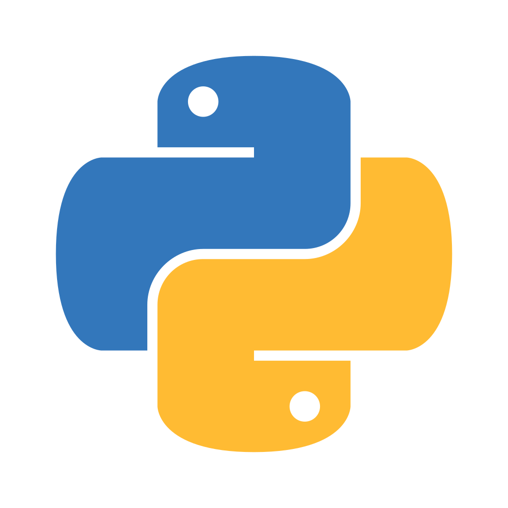
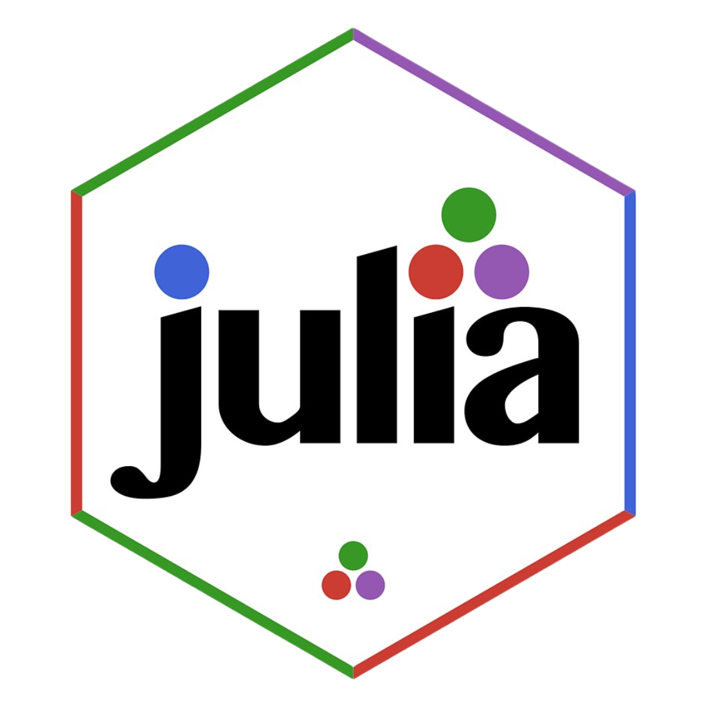
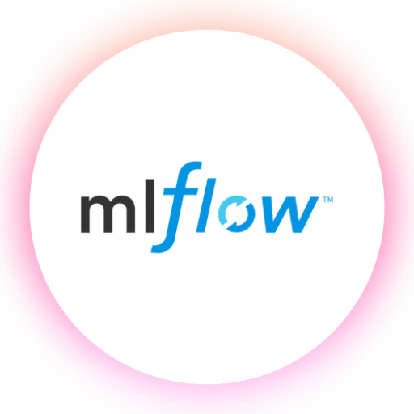
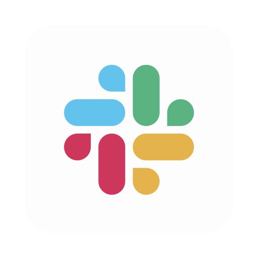

<section align = 'center'>
    <h1> Hey there! ✌🏼 I'm Oscar Zepeda </h1>
    
</section>  

Welcome to my world! 🌎 I'm an enthusiastic student of Computer Science and Technology 👾 in constant search for knowledge 🧠 and technological experiences 💚. In my day-to-day life 🩷, I enjoy exploring the convergence of project management 💼, data science 📊, artificial intelligence 🤖 and information technologies 👨🏻‍💻.

## 🔗 Connect with me
<section align = 'center'>
    
    
    
    
</section>

## 💻 Software Tools
<section>
    <table>
        <td align = 'center'>
            <h3> 👾 Programing languages </h3>
            
            
            
            
            
            
            
            
        </td>
        <td align = 'center'>
            <h3> 🔧 Development & Deployment </h3>
            
            
            
            
            
            
            
        </td>
    </table>
</section>

## 📈 Data Analysis
<section align = 'center'>
    
    
    
    
    
    
    
</section>

## 💼 Project Management
<section align = 'center'>
    
     
    
        
    
    
    
</section>

## 🌎 Linguistic Skills
- 🇲🇽 Spanish | Native proficiency
- 🇺🇸 English | Bilingual proficiency
- 🇫🇷 French | Professional working proficiency
- 🇰🇷 Korean | Limited working proficiency
- 🇧🇷 Portuguese | Limited working proficiency

## 📊 GitHub Public Stats
<section align = 'center'>
    <h3> Top Languages </h3>
    
    <h3> GitHub Stats </h3>
    
</section>

---

 Oscar Zepeda's Business Card 🐦‍⬛ 
