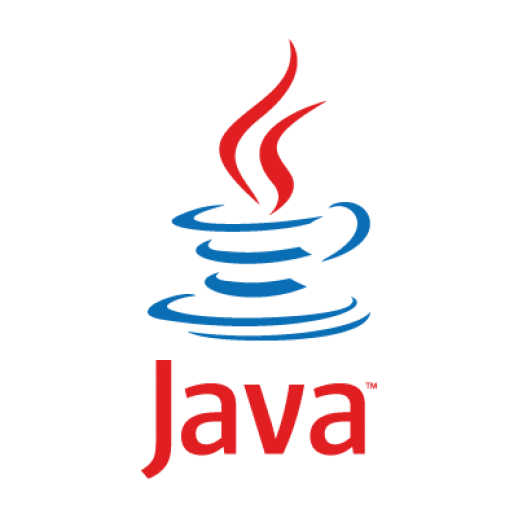
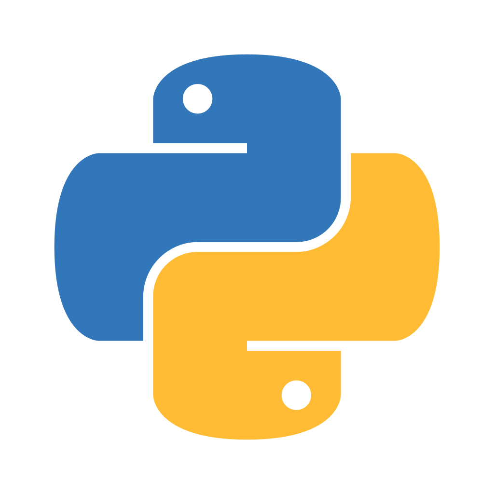
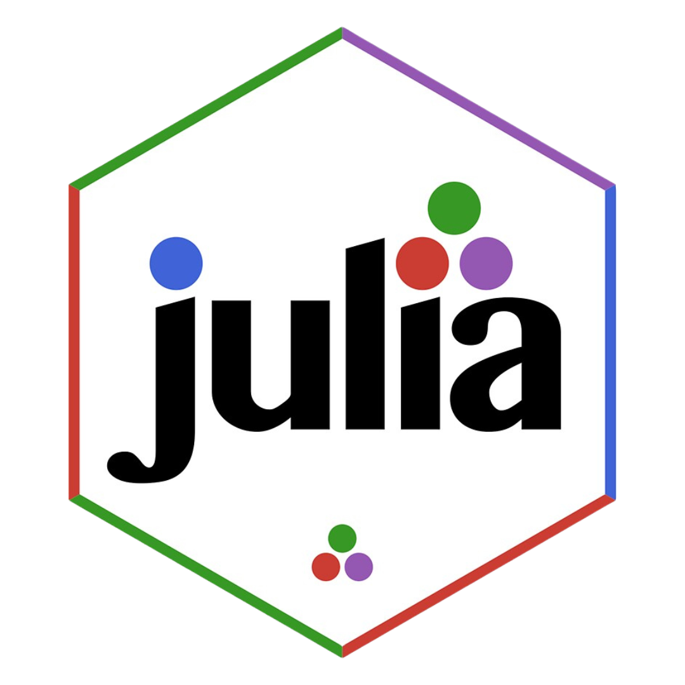
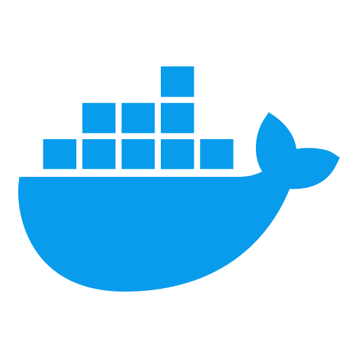
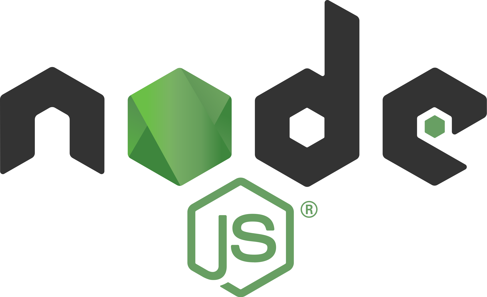
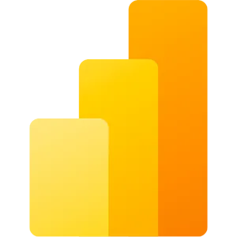
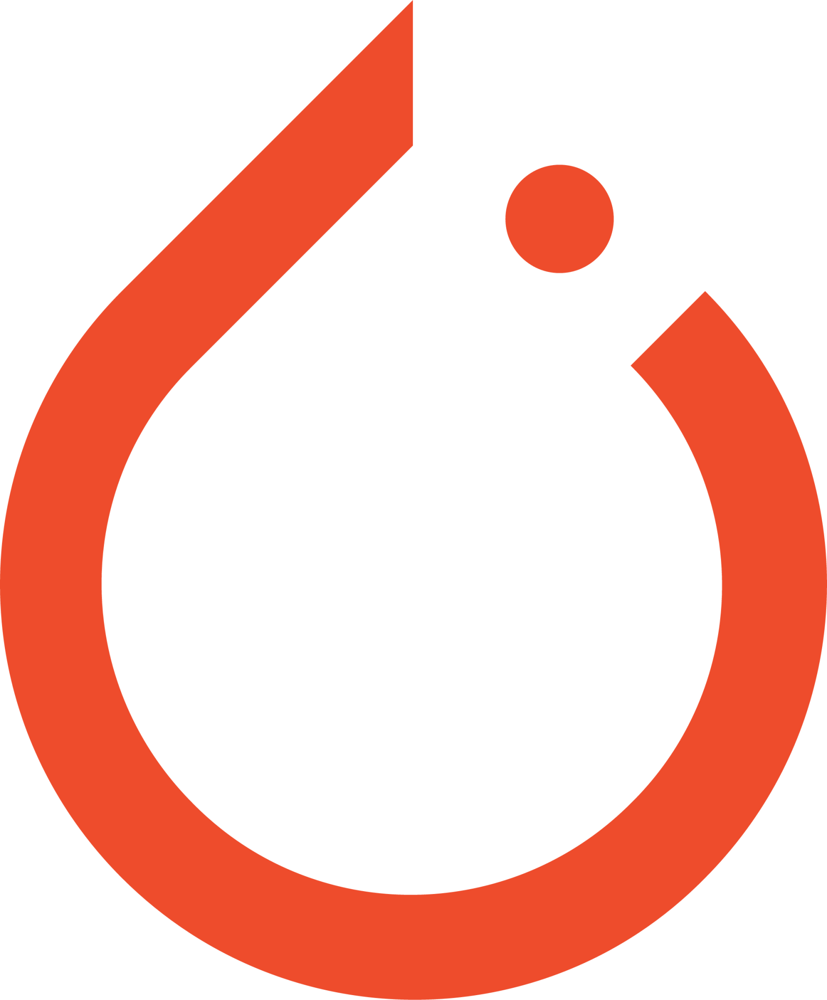

<section align = 'center'>
    <h1> Oscar Zepeda </h1>
</section>

<section align = 'center'>
    <h3> Welcome to my world! 🌎 </h3>
    Computer Science student in my 8th semester, building things with data and AI. Developer by day, DJ by night (basically a geek Batman).
</section>  

- 🗺️ Working with data at **HERE Technologies**.
- 🎞️ Just built **CinemAI**, an iOS app for movie recommendations.
- 🤝 Open to **collaborations and project opportunities**.
- 🏊‍♂️ Top 7% in **50m butterfly** swimming times.

## 🔗 Connect with me
<section align = 'center'>
    
    
    
</section>

## 💻 Software Tools
<section>
    <table>
        <td align = 'center'>
            <h3> 👾 Programing languages </h3>
            
            
            
            
            
            
            
        </td>
        <td align = 'center'>
            <h3> 🔧 Development & Deployment </h3>
            
            
            
            
            
        </td>
    </table>
</section>

## 📈 Data Analysis
<section align = 'center'>
    
    
    
    
    
    
</section>

## 🌎 Linguistic Skills
- 🇲🇽 **Spanish** | Native proficiency
- 🇺🇸 **English** | Bilingual proficiency
- 🇫🇷 **French** | Limited working proficiency
- 🇰🇷 **Korean** | Limited working proficiency

---

 Oscar Zepeda's GitHub Profile 🐦‍⬛ 
